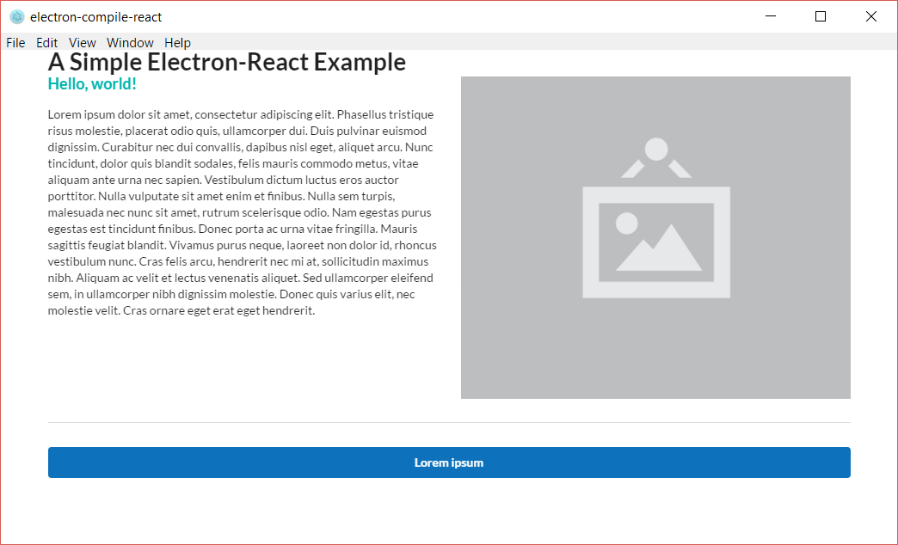

# electron-compile-react
> A simple Electron-React app to be used as a boilerplate.

For more Electron resources, see [Awesome-electron](https://github.com/sindresorhus/awesome-electron).

---


This boilerplate uses the following technology:
- [Electron](http://electron.atom.io/ "Electron's Homepage"): framework for native desktop apps using web technologies
- [electron-prebuilt-compile](https://github.com/electron-userland/electron-prebuilt-compile): powered by [electron-compile](https://github.com/electron/electron-compile) to compile JS and CSS
- [React](https://facebook.github.io/react/): the UI
- [Babel](http://babeljs.io/): a JavaScript compiler
- [Bootstrap 3](http://getbootstrap.com/): a responsive CSS framework
- [react-devtools](https://github.com/facebook/react-devtools): an extension of Chrome's developer tools for React components. Installed using [electron-devtools-installer](https://github.com/MarshallOfSound/electron-devtools-installer)





# Installation

### Prerequisites
- Ensure Node.js and npm are installed. If not, Node can be installed from [here](https://nodejs.org/en/ "Node.js.org").
- Also make sure that Electron is installed globally `npm install -g electron`.

### Install the app
```bash
git clone https://github.com/sparksc/electron-compile-react.git
cd electron-compile-react
npm install
npm start
```


# Project Structure
```
+ css/
+ release/				Packaged applications by platform
+ resources/			  Project assets (images/icons, etc.)
- src/					Source directory
 |+ components/		   React components
App.js					Renders the app's react components
index.html				The entry point of the app
index.js				  Electron configuration
package.json
```


# Editor Configuration
#### Atom
```bash
apm install linter linter-js-standard-jsx react autocomplete-modules javascript-snippets
```

# Other UI Options
The current template uses Bootstrap, but here are a few other front-end frameworks that can be used instead:
- [Semantic UI](http://semantic-ui.com/)
- [Foundation](http://foundation.zurb.com/)
- [Materialize](http://materializecss.com/)
- [Material-UI](http://www.material-ui.com/#/)
- [React Desktop](https://github.com/gabrielbull/react-desktop)
- [Photon](http://photonkit.com/)
- And more...
